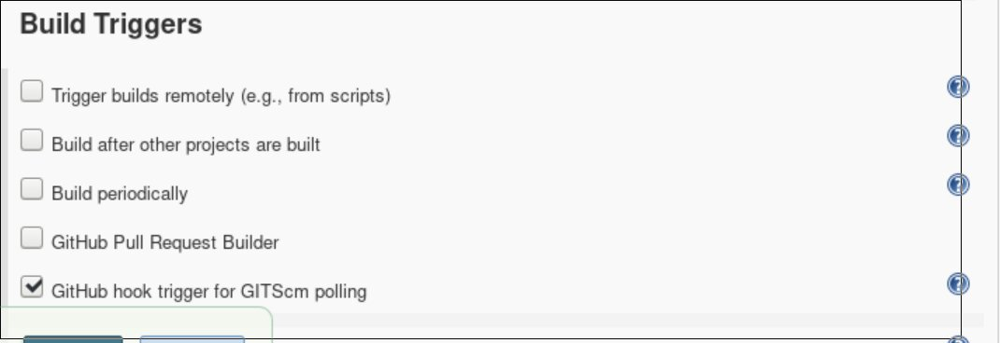

:smile: :smile: :smile: :smile: :smile: :smile:
# Setup three three teams/environemnts
### 1.Poduction
### 2.Testing
### 3.Quality Assurance

 ## PROBLEM STATEMENT :

## JOB#1

### If Developer push to dev branch then Jenkins will fetch from dev and deploy on dev-docker environment.

## JOB#2

### If Developer push to master branch then Jenkins will fetch from master and deploy on master-docker environment.both dev-docker and master-docker environment are on different docker containers.

## JOB#3

### jenkins will check (test) for the website running in dev-docker environment. If it is running fine then Jenkins will merge the dev branch to master branch and trigger #job 2
# Requirements

1. Docker httpd Image
1. Jenkins
1. Github Plugin
1. Git and Hooks
1. Github and Github Webhooks
1. ngrok
## EXPLANATION:

## JOB 1 :

### Created a job named job1 and test_env for this ,the developer when commits it pushes to github automatically using git post-commit hook and github webhook triggered job job1 where the code is copied and after successful copy the next job which is chained it with gets initiated and the docker is launched with the configurations same as that of production environment and when QAT team certified it is merged using remote trigger through jenkins

### I create a github-webhook so when the Developer_2  commit jenkins job1 auto run and first remove older test_env and create a new test_env every time on same docker image use.

## It trigger only when github-webhook 

## Below scriptis run when jenkins trigger

## After commit job

## 

## JOB 2:

### Created a job named job2 and prod_env for this ,the developer when commits it pushes to github automatically using git post-commit hook and github webhook triggered job job2 where the code is copied and after successful copy, the next job which is chained it with gets initiated and the docker is launched with the configurations as done and is again triggered when QAT team certified the test branch code.

## I also craete  github-webhook so when the Develope_1  commit jenkins job2 auto run and create   production_env and  every time same docker image use.

## It trigger only when Developer_1 commit

## Below scriptis run when jenkins trigger

#### JOB 3:
### All the configurations are done in Jenkins with job named Job3 and it is triggered by remote trigger by the QAT team and it also initiates the JOb2 and merges the test branch with the master branch; by first building the test branch code files and then merge it to the origin/master branch and then pushed to github and 2nd job is triggered again and deployed to production environment.

## Source Code Management .This merge the test branch with master branch

## For runnig the Job3 create a token

## Push the master branch on github

## DEVELOPER SIDE 

###  :grinning: First i created a repository in my base-OS and git initialized it. then going to directory .git/hooks/ inside it I created a post-commit hook which would self push the repository whenever the developer committed something to git. I also added a remote trigger for my job1 after it so after the code was pushed onto GitHub it would automatically trigger job1.

### :smile: Developer craete a html file and commit 

# After commit 
## test webserver 

## production server 

## After QAT 

